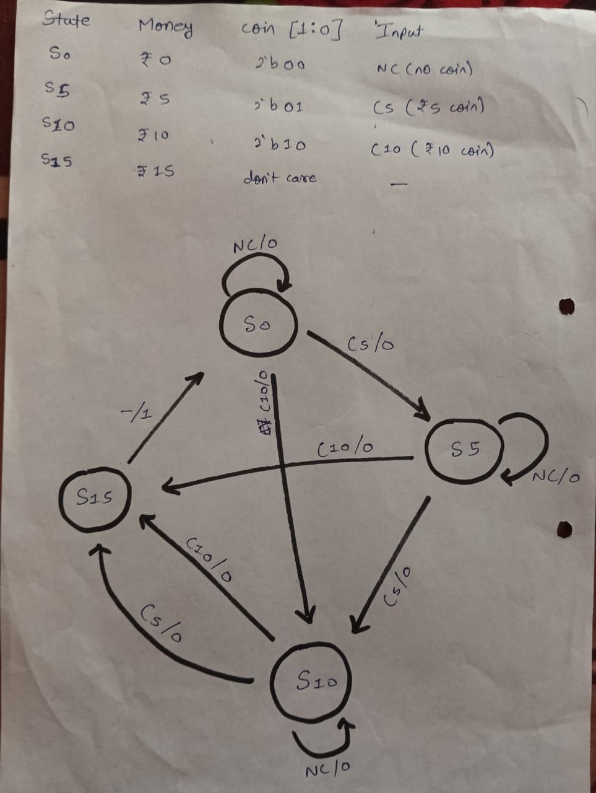
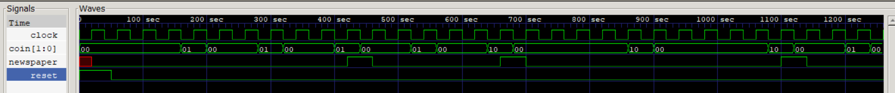
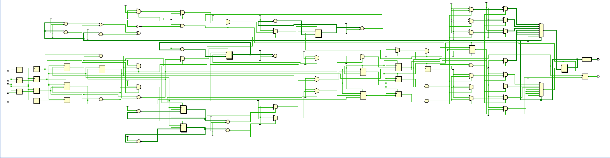
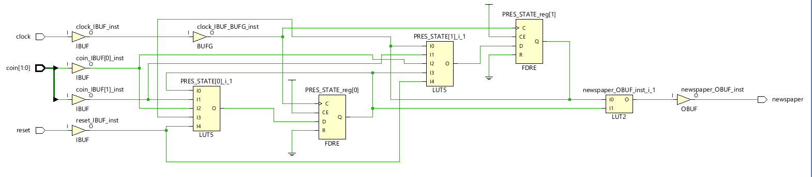

# 📰 Newspaper Vending Machine FSM – Verilog HDL

> **Hands-on Digital Design & Hardware Verification | FPGA-Ready**  
> *Showcasing practical hardware modeling, testbenching, & professional project documentation*

---



---

## 📚 Overview

This project models a **Newspaper Vending Machine** using a precise, synthesizable Finite State Machine (FSM) in Verilog HDL. The system dispenses a newspaper when the sum of inserted coins reaches **15 units**—accepting only 5-unit and 10-unit coins.  
Designed for clarity, reliability, and real-world fidelity, this project demonstrates end-to-end digital system development: from RTL design to rigorous simulation and verification.

---

## 🚀 Key Features

- **Professional HDL Design:** FSM-based control, suitable for FPGA/ASIC.
- **Robust Verification:** Realistic testbenches prove system correctness and edge cases.
- **Comprehensive Documentation:** Clear code comments, signal/state diagrams, and simulation output included.
- **Reset Handling:** Supports asynchronous/synchronous resets for reliability.
- **Modern Workflow:** Includes waveform files for GTKWave and structured test scenarios.

---

## 🏗️ Project Architecture

Core state transitions:

| State | Meaning              | On 5-coin      | On 10-coin   | Else       |
|-------|----------------------|----------------|--------------|------------|
| s0    | 0 units (reset)      | s5             | s10          | s0         |
| s5    | 5 units              | s10            | s15 *(disp.)*| s5         |
| s10   | 10 units             | s15 *(disp.)*  | s15 *(disp.)*| s10        |
| s15   | 15 units *(dispense)*| ➔ s0 (reset)   | ➔ s0 (reset) | s0 (reset) |

- **Coin Input Encoding:**  
  - `2'b00` = No coin  
  - `2'b01` = 5-unit coin  
  - `2'b10` = 10-unit coin

**State Diagram:**  


---

## 🧪 Simulation & Verification

### Testbench Scenarios
- 3 × 5-unit coins → Dispense
- (5-unit + 10-unit) coin → Dispense
- 2 × 10-unit coins (tests overpayment logic)
- Runtime Reset (tests robustness)

#### Sample Output
<pre>
  Time   Reset Newspaper
   420     0      1   // 3 × 5-unit coins
   460     0      0
   660     0      1   // 5 + 10 coins
   700     0      0
  1100     0      1   // Two 10-unit coins (overpayment)
  1140     0      0
</pre>

**Waveform Example:**  


*Open in GTKWave for detailed analysis.*

---

## 🗂️ Files & Structure

```
.
├── Basys3/                    # FPGA constraints & files
├── Code/                      # HDL source and modules
├── Iverilog_output.png        # CLI output screenshot
├── Newspaper_state_diagram.jpeg # FSM state diagram (above)
├── RTL_Schematic.png          # Synthesized RTL schematic
├── Technology Schematic.png   # Technology-mapped schematic
├── Testbench/                 # Functional verification
├── Waveform_output.png        # Simulation waveform
└── README.md                  # Project documentation (you are here)
```

---

## 🛠️ How to Run

1. **Simulation**  
   ! Run using Icarus Verilog or any supported simulator:
   ```sh
   iverilog -o newstb Testbench/newstb.v Code/news.v
   vvp newstb
   ```

2. **View Waveforms**  
   ! Analyze hardware timing and signals:
   ```sh
   gtkwave Waveform_output.vcd
   ```
   *(Images provided for instant reference.)*

---

## 📈 Additional Visuals

| RTL Schematic      | Technology Schematic |
|:------------------:|:-------------------:|
|  |  |

---

## 🏆 Skills Demonstrated

- Digital logic design & FSM modeling in Verilog
- Hardware simulation, verification, and testbenching
- Schematic capture, waveform analysis (GTKWave)
- FPGA-ready coding practices (Basys3 support files)
- Rigorous project structuring and documentation
- Problem-solving under real-world constraints

---

## 📄 License

Distributed under the [MIT License](LICENSE).  
© 2025 Tejas R Mallah

---

## 🤝 Contact

- **LinkedIn:** [Tejas R Mallah](https://www.linkedin.com/posts/tejas-r-mallah-28052b283_verilog-fpga-digitaldesign-activity-7364343834392113152-s981?utm_source=share&utm_medium=member_desktop&rcm=ACoAAET0mcABoSmVvowkUz7qcSZkG2bhRVZnDQ4)
- **Email:** tejasmallah@gmail.com

---

_Actively seeking opportunities in Digital Design, FPGA, RTL coding, and Hardware Verification.  
Open for collaborations and internships focused on innovation and engineering excellence!_

---

> *#Verilog #DigitalDesign #FSM #VendingMachine #FPGA #RTL #HardwareDesign #Testbench #StateMachine*

_Always open to opportunities and collaboration in digital design, FPGA, and hardware verification!_

```
#Verilog #DigitalDesign #FSM #VendingMachine #FPGA #RTL #HardwareDesign #Testbench #StateMachine
```
